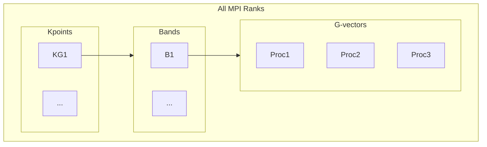

_TL.DR for VASP_

- Maximise k point parallelisation whenever possible
- keep number of bands per band group > 10 for GGA calculation
- use as little lower plane wave parallelisation as possible for hybrid calculations, but keep bands per band group > 4
- do not over parallelise by using too many core - you can end in the wrong side of the scaling curve

When done efficiently plane wave density functional theory calculations can be very cost-effective for systems up to a few hundreds of atoms.
However, there are things to watch out for and ones needs to understand the how parallelisation works in order to maximise the efficiency.

While sensible "defaults" are often described in the documenting or chosen by the code itself, there is one thing that the code cannot choose - the number of MPI processors to be used.
Unfortunately, when the calculation is slow, the common reaction is to put more CPUs at work, which, in some cases, can even lead to slower calculation and drastic performance drops.

First, let's think about basic theory of parallelisation. I will not pull out the exact equation here though.
For any given program, it consists of parallelisable and serial parts.
Adding more parallelism will make the former faster (in the ideal case), but leave the latter unchanged.
This explains the inevitable drop of the speed-up vs num-of-cpus plot, as the latter becomes more and more the dominate contribution to the run time.
In addition, parallelisation also have certain overheads, each processor needs to communicate with others in some ways, and the communication cost may increase with increase number of core.
This is the cause of the drop in the efficiency with high core counts in the many case.
Even if the communication cost does not scale with the number of cores, its contribution to the "parallelised" part still increases with the number of processors because of time of doing actual work becomes less and less.

Second, let's briefly describe how plane wave DFT codes are parallelised.
Most of the codes are parallelised over MPI, the program that is run with each MPI process, but directives are included in the code itself to orchestrate communication and memory distribution.
The parallelisation is commonly conducted by three levels:

- kpoints
- bands
- plane wave coefficients

Each level corresponds to one of the indices of the "wavefunction" ($W_{kbc}$) which is a multidimensional array.
The kpoint parallelisation is the most efficient one, exploiting the fact that each kpoints are almost independent with each other - they only talk to each other via the electron density (which is not the case any more in hybrid DFT).
The band parallelisation is conducted by distributing the bands over certain number of processors, and implementing parallel solvers and algorithms.
The plane wave coefficients are involved in FFT, and they can be parallelised and distributed as well.
Unlike the other two levels, parallelisation over kpoint does not distribute the memory, each process still receives the fully set of kpoints.
This is not the case with band and plane wave parallelisation, however, these two does involve heavy ("all-to-all") communications, making it more and more difficult to scale well on large core counts.
On the other hand, one can expect almost perfect scaling with k-point parallelisation.
There are of course many fine details on this topic, and many other part of the code (for example, auxiliary arrays and ionic solvers) can cost memory.
The diagrams below show the relationship between these levels of parallelisation.



At bit on the terminology - the number of _kpoint/band groups_ means that MPI processes are divided into $N$ groups for this level, and each group may contain $M$ number of processes.
Hence, $M \times N$ is the total number of processes for this level. Typically, $N$ must be a divisor of the quantity to be parallelised over.
For example, for a 320-process calculation with 4 kpoints and 120 bands, there can be:

- 4 kpoint groups, each with 80 processes, each group works on 1 kpoint
- 4 band groups inside each kpoint group, each group works on 30 bands
- inside each band group, the work is further parallelise over the G-vectors

For VASP, this information can be obtained on the top of the `OUTCAR`:

```
 running  384 mpi-ranks, with    1 threads/rank
 distrk:  each k-point on   32 cores,   12 groups
 distr:  one band on NCORE=   8 cores,    4 groups
```

means there are 12 kpoint groups (32 processes each), 4 band groups (8 processes each).
This this calculation there are 48 band, hence each band group has 12 bands to work on.
Further down the file:

```
 k-point  19 :   0.4000 0.4000 0.0000  plane waves:   21064
 k-point  20 :   0.5000 0.4000 0.0000  plane waves:   21070
 k-point  21 :   0.5000 0.5000 0.0000  plane waves:   21084

 maximum and minimum number of plane-waves per node :      2702     2616

```

Shows that each processor inside the band group gets about 2700 plane-waves (G-vectors) to work on.
If `NCORE` is increased, this value will reduce.
When there are too few plane waves to be parallelised, the overall efficiency will drop sharply.
However, increasing `NCORE` also increases the number of bands each band group works on, so improving the parallel efficiency over bands.

To summarise, one should maximise the K-point parallelisation,
and balance band and G-vector parallelisation by tuning the `NCORE` parameter.
If one is in a regime that both band and G-vector parallelisation have similar efficiency, choosing `NCORE` roughly a square root of the number of processors per group would be optimum.
For relatively small GGA calculations, setting `NCORE` to be equal to the number of cores in a [NUMA region](https://en.wikipedia.org/wiki/Non-uniform_memory_access) can be a sensible choice.
In those cases, further optimisation of `NCORE` may only provide limited gain in speed.

## Hybrid functional calculations

Hybrid functional calculations often requires a large amount of computing resources to be used for a single calculation to achieve reasonable time to solution (e.g. within a few days).
While these calculations are easier to scale purely as a result of them being very compute-heavy (they scale to thousands of cores, while most GGA calculation won't), careful tuning of parallelisation becomes even more important as every bit of performance gain can leads to huge saving of resources.
Thus, one should carefully perform timing analysis for these calculations, typically using the _debug_ or _short_ queue of the supercomputer and run only for a few SCF cycles.

In those cases, I would:

- parallelise over K points as much as possible if memory permits
- start from a low NCORE given that the number of bands per band group is more than 4
- to solve memory issue, reduce the kpoints before switching to "under-populate" the nodes.

Because of the sheer among of resources needed for hybrid DFT, it is very easy to over-parallelise calculations and waste resources. So _test, test, test_.....

Example tests over `NCORE` for a 65-atom CdTe defect supercell calculation with 8 kpoints (`KPAR=8`), 346 bands (minimum), 47528 plane waves using HSE06 (`ALGO=normal`) with VASP6 on [ARCHER2](https://www.archer2.ac.uk):


It can be seen that the best performance is achieved with `NCORE=4` note that this calculation may actually involve more bands than `NCORE=8` and `NCORE=16`.
Using `NCORE=1` or `NCORE=2` resulted in very bad performance, probably because there were only one or two bands per band group, and note that the speed up from 1280 to 2560 cores is even worse.
`NCORE=4` result in about 5 bands per band group (of 80 cores) for the 2560-core calculation and 9 bands per group (of 40 cores) for the 1280-core calculation.
Also note the speed up by doubling the core-count - we achieve a 80% gain in speed by throwing twice the computing resource - not bad at all.

## Further topics

We haven not touched OpenMP parallelisation and GPU parallelisation.
I have seen good performance with the latter on latest generation of GPUs (e.g. Nvidia A100) for compute heavy hybrid functional VASP calculations.
The OpenMP parallelisation can often be used to "recycle" idle cores on underpopulated nodes.

We have not touched parallelisation in CASTEP, which is often planned by the code itself rather than the user.
Nevertheless, manual tuning can be valuable for large-scale calculations to achieve the good performance.
